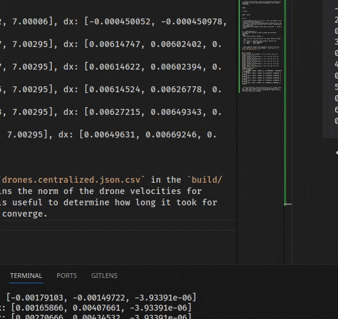

# Drone Swarm Simulator

Drone swarm simulator for testing drone formation algorithms

## Introduction

This is a drone swarm simulator that implements the 2 most common drone swarm algorithms - Decentralized and Centralized

The simulator is made with performance in mind, the key highlights are:

- Running drones in parallel with a thread pool using `std::jthread` that enables clean "forever" loops with `std::stop_token`.
- Threads are created just once and then reused forever so that there is no overhead of creating and destroying threads.
- Using `std::barrier` for thread synchronization to ensure that the computation of control algorithms happens efficiently in parallel, but the world state is updated only when all threads are finished. This ensures that the world state is correct at each time step.
- Using `constexpr` for expressing things like Drag, so that a lot of the computation can happen at compile time.
- Using `std::reduce` for summing things up for better performance.

## Usage

### Install Dependencies

#### Build tools

Install these with your own package manager, these versions are based on what is available in Ubuntu 22

- gcc: <= 11.2 with support for C++20
- CMake: <= 3.22

#### Conan

Install Conan (v1) for dependency management

- Debian based: `sudo pip install --force-reinstall -v "conan==1.62.0"`
- Arch based: `conan1` from AUR using your favorite AUR helper
  - Example, using pamac: `sudo pamac install conan1`
- Mac: `brew install conan@1`

Enable libstdc++11

- `conan profile new default --detect`
- `conan profile update settings.compiler.libcxx=libstdc++11 default`

#### Gnuplot

Install gnuplot for viewing the results

- Debian based: `sudo apt install gnuplot`
- Arch based: `sudo pacman -S gnuplot`
- Mac: `brew install gnuplot`

### Compile

Once the dependencies have been installed, everything can be taken care of by cmake.

1. Create a build directory:

```
mkdir build && cd build
```

2. Initialize build (This is where all the external libraries are downloaded, so it may take some time depending on your internet connection)

```
cmake ..
```

3. Build:

```
cmake --build .
```

### Run

- The executable will be in `build/bin`, and it will expect a json file with the drone information.
- Examples for centralized and decentralized formations are in the `test` folder, which you can copy to the `build/bin` folder before running the binary.
- The command-line arguments can be seen by using the `-h` flag as follows:

```
$ > ./drone-swarm-sim -h
A program that simulates a swarm of drones with different algoirthms.
Usage:
  Drone Swarm Simulator [OPTION...]

  -f, --file arg  Drone description file (json) (default: drones.json)
  -t, --time arg  Simulation time (seconds) (default: 30)
  -d, --debug     Enable debugging
  -h, --help      Print usage
```

- Basic usage and output after copying the `drones.c4.decentralized.json` file into `build/bin` and running `./drone-swarm-sim -f drones.c4.decentralized.json -t 10`

```
World::Start
World::Started ..
World::runDrone for 1(Decentralized): x: [1, 2, 0], dx: [0, 0, 0], Target: [1 [4, 5, 7], 2 [0, -1, 0], 3 [-1, -2, 0], 4 [-2, -1, 0], 6 [-1, 1, 0], ]
World::runDrone for 2(Decentralized): x: [2, 3, 0], dx: [0, 0, 0], Target: [1 [0, 1, 0], 2 [4, 6, 7], 3 [-1, -1, 0], 4 [-2, 0, 0], 5 [-2, 1, 0], ]
World::runDrone for 3(Decentralized): x: [3, 4, 0], dx: [0, 0, 0], Target: [2 [1, 1, 0], 3 [5, 7, 7], 4 [-1, 1, 0], 5 [-1, 2, 0], 6 [0, 3, 0], ]
World::runDrone for 4(Decentralized): x: [4, 5, 0], dx: [0, 0, 0], Target: [1 [2, 1, 0], 3 [1, -1, 0], 4 [6, 6, 7], 5 [0, 1, 0], 6 [1, 2, 0], ]
World::runDrone for 5(Decentralized): x: [5, 6, 0], dx: [0, 0, 0], Target: [1 [2, 0, 0], 2 [2, -1, 0], 4 [0, -1, 0], 5 [6, 5, 7], 6 [1, 1, 0], ]
World::runDrone for 6(Decentralized): x: [6, 7, 0], dx: [0, 0, 0], Target: [1 [1, -1, 0], 2 [1, -2, 0], 3 [0, -3, 0], 5 [-1, -1, 0], 6 [5, 4, 7], ]
Stopping simulation ...
Final attitudes:
1: x: [4.00051, 5.00114, 7], dx: [-0.00117867, -0.00152092, -3.93391e-06]
2: x: [4.00032, 6.00045, 7], dx: [-0.00150204, -0.00365912, -3.93391e-06]
3: x: [4.99991, 6.99963, 7], dx: [0.000107338, -0.00174164, -3.93391e-06]
4: x: [5.99917, 5.9986, 7], dx: [-0.00179103, -0.00149722, -3.93391e-06]
5: x: [6.00045, 5.00029, 7], dx: [0.00165866, 0.00407661, -3.93391e-06]
6: x: [4.99964, 3.99989, 7], dx: [0.00270666, 0.00434532, -3.93391e-06]
```

- A window should pop up showing the simulation
  
- You will also see a `drones.c4.decentralized.json.csv` in the `build/bin` folder that contains the norm of the drone velocities for every time step. This is useful to determine how long it took for the drone formation to converge.
